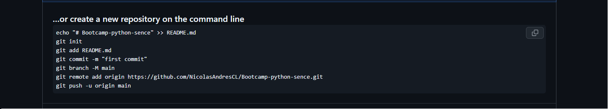
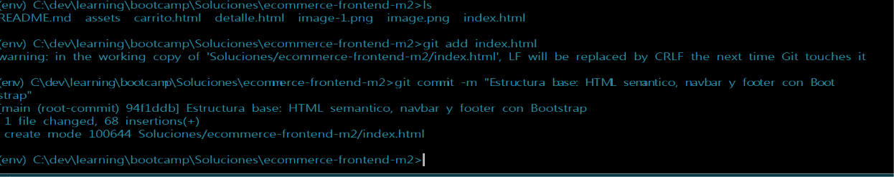
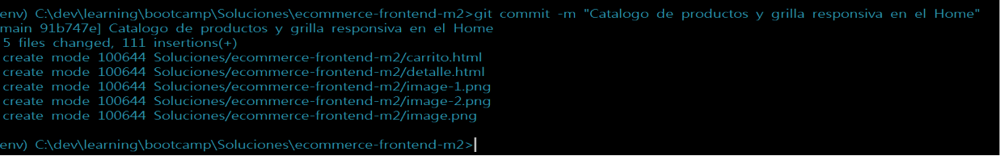
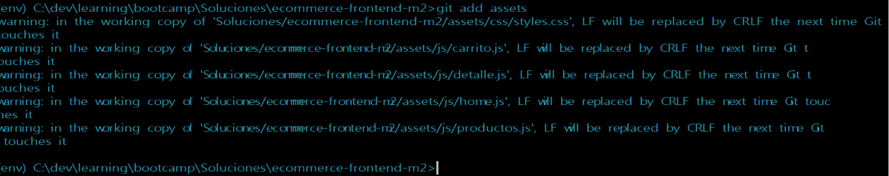

# AstroShop — E-commerce Frontend (Módulo 2)

MVP del frontend de una tienda en línea de temática espacial, construido con
**HTML5 semántico**, **Bootstrap 5** (por CDN) y **JavaScript** básico.
El carrito se mantiene entre páginas usando `localStorage`.

> Repositorio público: **git remote add origin https://github.com/NicolasAndresCL/Bootcamp-python-sence**
> _(reemplaza este enlace por el de tu repo cuando lo subas a GitHub)._

## Cómo ejecutarlo

No necesita instalación. Tienes dos opciones:

1. Abrir `index.html` directamente en el navegador (doble clic), o
2. Usar la extensión **Live Server** de VS Code (clic derecho → "Open with Live Server").

> Requiere conexión a internet, porque Bootstrap y las imágenes de ejemplo
> se cargan desde un CDN.

## Estructura del proyecto

```
ecommerce-frontend-m2/
├── index.html          # Home: grilla de productos
├── detalle.html        # Detalle de un producto (?id=)
├── carrito.html        # Carrito simulado y total
├── README.md
└── assets/
    ├── css/styles.css  # estilos propios
    └── js/
        ├── productos.js # catálogo + lógica del carrito (compartido)
        ├── home.js      # render de la grilla
        ├── detalle.js   # render del detalle
        └── carrito.js   # render del carrito y total
```

## Funcionalidades

- **Home:** grilla responsiva de productos con cards de Bootstrap.
- **Detalle:** imagen, categoría, precio, descripción y botón "Agregar". Se
  accede desde el botón "Ver más" de cada card (el id viaja en la URL).
- **Carrito:** lista los ítems con cantidad, precio unitario y subtotal, y
  muestra el **total a pagar**. Permite quitar productos, vaciar y "finalizar".
- **Contador en el navbar:** un badge muestra cuántas unidades hay en el
  carrito y se actualiza en tiempo real en todas las páginas.
- **Responsive:** se ve bien en móvil (≤ 420 px) y escritorio (≥ 1024 px).

## Cómo cumple la rúbrica

| Requisito | Dónde se cumple |
|-----------|-----------------|
| HTML5 semántico (`header`, `nav`, `main`, `section`, `article`, `footer`) | las 3 páginas |
| Bootstrap: grid, utilidades y componentes (navbar, card, button, badge) | las 3 páginas |
| Inclusión de Bootstrap por CDN | `<head>` y antes de `</body>` |
| JS básico: `querySelector`, eventos `click`, funciones, arrays/objetos | `assets/js/*` |
| Contador del carrito actualizado en tiempo real | `actualizarContador()` en `productos.js` |
| Navegación Home → Detalle → Carrito | enlaces del navbar y botón "Ver más" |

## Subir a GitHub (mínimo 3 commits descriptivos)

```bash
cd ecommerce-frontend-m2
git init
git add index.html assets/
git commit -m "Estructura base: HTML semantico, navbar y footer con Bootstrap"

git add assets/js/home.js assets/js/productos.js
git commit -m "Catalogo de productos y grilla responsiva en el Home"

git add assets/js/carrito.js assets/js/detalle.js carrito.html detalle.html
git commit -m "Carrito con localStorage, contador en navbar y pagina de detalle"

git branch -M main
git remote add origin https://github.com/USUARIO/ecommerce-frontend-m2.git
git push -u origin main
```





