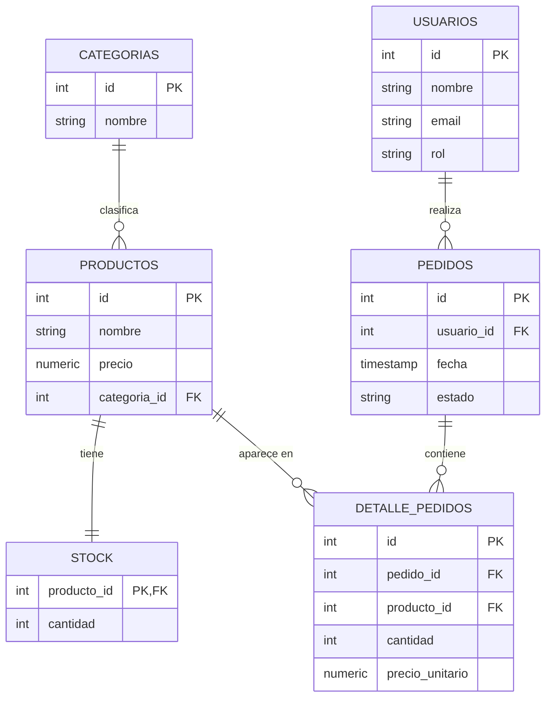

# Modelo Entidad-Relación — Ecommerce (Módulo 5)

> Exporta el bloque Mermaid a PNG (https://mermaid.live) y guárdalo como
> `modelo_er.png` para cumplir el entregable de "diagrama ER (imagen)".

## Decisiones de diseño

- **Categorías → Productos:** un producto pertenece a una categoría (1:N).
- **Productos → Stock:** relación 1:1; cada producto tiene un registro de
  stock con su cantidad disponible.
- **Usuarios → Pedidos:** un usuario realiza muchos pedidos (1:N). El campo
  `rol` distingue a clientes de administradores.
- **Pedidos ↔ Productos:** relación N:M resuelta con `detalle_pedidos`, que
  además guarda la `cantidad` y el `precio_unitario` al momento de la compra.
