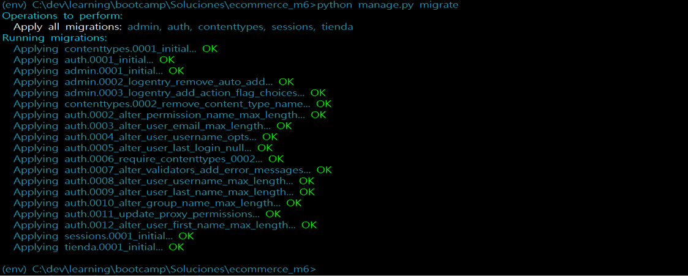
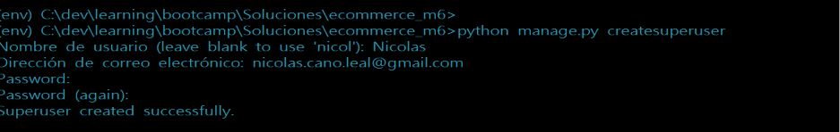
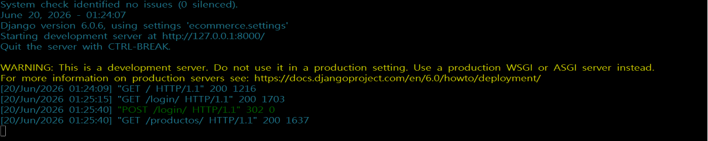
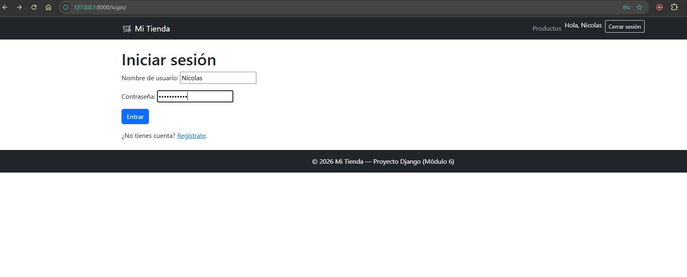
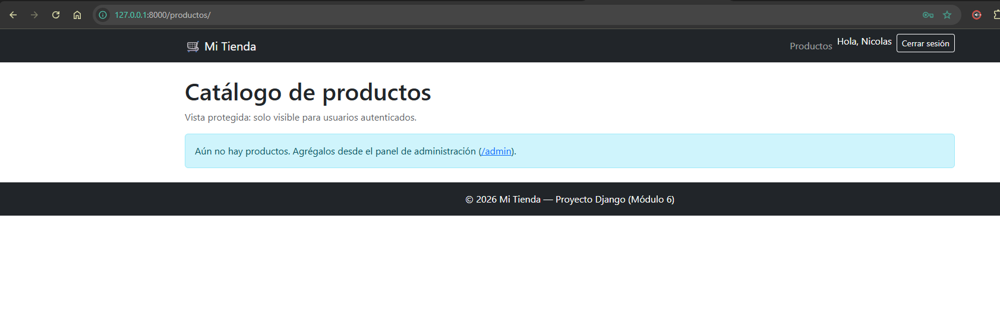
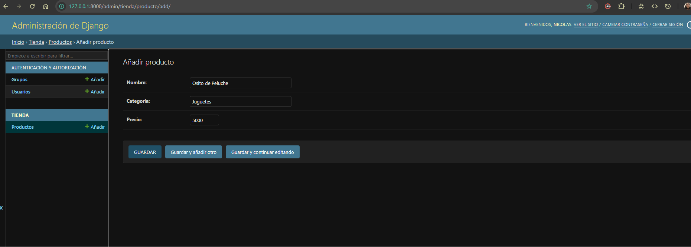
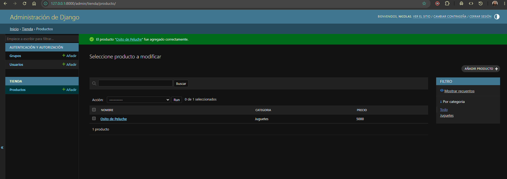
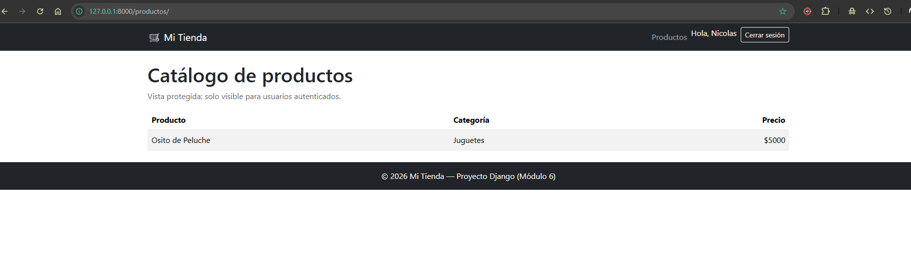
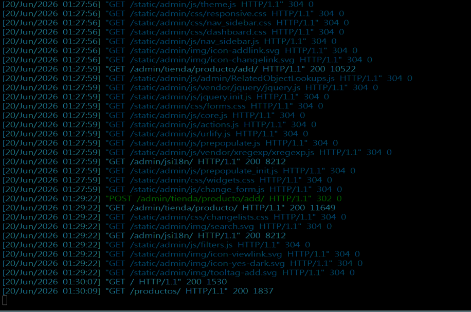

# Módulo 6 — Ecommerce con Django (Autenticación)

Aplicación web con Django que implementa **autenticación de usuarios**
(login, logout, registro) y una **vista protegida** (el catálogo de
productos), con navegación que cambia según el estado de la sesión.

## Pasos para ejecutar

```bash
python -m venv env
env\Scripts\activate           
pip install django

python manage.py migrate
python manage.py createsuperuser   
python manage.py runserver
```

Abrir http://127.0.0.1:8000/

## Rutas principales

| Ruta | Descripción | Acceso |
|------|-------------|--------|
| `/` | Inicio | Público |
| `/registro/` | Crear un nuevo usuario | Público |
| `/login/` | Iniciar sesión | Público |
| `/logout/` | Cerrar sesión (POST) | Autenticado |
| `/productos/` | Catálogo (vista protegida) | Solo autenticados |
| `/admin/` | Panel de administración | Staff/superusuario |

## Cómo cumple la rúbrica

- **Login y logout:** vistas incorporadas de Django (`LoginView`, `LogoutView`).
- **Registro de usuario:** `RegistroView` con `UserCreationForm`; tras crear la
  cuenta, el usuario puede iniciar sesión.
- **Vista protegida:** `ProductosView` usa `LoginRequiredMixin`; un usuario sin
  sesión es redirigido a `/login/?next=/productos/`.
- **Templates y navegación:** `base.html` con herencia (`` /
  ``); el navbar muestra "Iniciar sesión / Registrarse" o
  "Productos / Cerrar sesión" según el estado de la sesión.
- **Estructura ordenada:** proyecto `ecommerce` + app `tienda`.

## Usuario de prueba

Crea uno con `createsuperuser`, o regístrate en `/registro/`. Para que el
catálogo muestre datos, agrega productos desde `/admin/`.

## Evidencia (capturas sugeridas)

1. Registro de usuario en `/registro/`.
2. Inicio de sesión en `/login/`.
3. Acceso a la vista protegida `/productos/` (y la redirección al login si no
   hay sesión).


## Evidencias

















